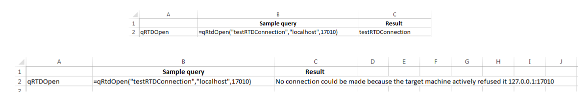
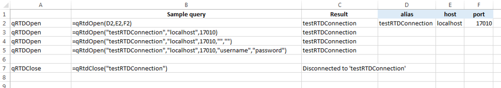
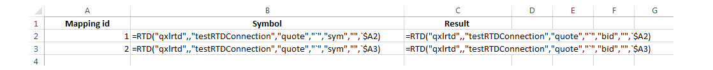

[:arrow_backward:](RTD-API-Functions.md) | [:arrow_forward:](Type-Mapping.md)

# RTD examples

- [Preliminaries](RTD-Examples.md#preliminaries)
- [Opening and closing connection](RTD-Examples.md#opening-and-closing-connection)
- [Configuration](RTD-Examples.md#configuration)
- [Subscribe single symbol](RTD-Examples.md#subscribe-single-symbol)
- [Subscribe all symbols](RTD-Examples.md#subscribe-all-symbols)
- [Opening and closing the workbook](RTD-Examples.md#open-close)

<!--------------------------------------------------------------------------------------------------------------------->

## Preliminaries

> :white_check_mark: Hint:

> All examples are available in Excel format from [here](examples/).

#### Q process

Before running examples it is assumed that `Exxeleron` system from [Lesson04](../../../../enterprise-components/edit/master/tutorial/Lesson04) 
 is installed [Lesson04](../../../../enterprise-components/edit/master/tutorial/Lesson04) on the local server. 


#### Excel list separators

Please note that depending on `Region` settings different separators can be used. All examples below use US regional 
settings where the separator is set to comma `,`:

```
=qRtdOpen("testConnection","localhost",17010,"username","password")
```

However, some European countries use semicolon `;` instead:

```
=qRtdOpen("testConnection";"localhost";17010;"username";"password")
```

Please make sure to adjust your separator in the code snippets accordingly. Please follow 
[this link](http://windows.microsoft.com/is-is/windows/change-country-region-setting#1TC=windows-7) from Microsoft 
for more details.

<!--------------------------------------------------------------------------------------------------------------------->
## Opening and closing connection

To open a RTD connection to q process, necessary parameters need to be passed to `qRtdOpen` function:

```
=qRtdOpen("testRTDConnection","localhost",17010)
```

> Note:

> Typically, on production environment one would need to also pass username and password as parameters:
> ```
> =qRtdOpen("testRTDConnection","localhost",17010,"username","password")
> ```

If q process is running, `alias` for connection will be shown in the cell where `qRtdOpen` function was entered. 
Otherwise, error message will appear:




To close the connection again, use the same alias as given in the `qRtdOpen` function:

```
=qRtdClose("testRTDConnection")
```

If connection is terminated, the `Disconnected from 'testRTDConnection'` message will be shown. Consecutive calls (without invoking another `qRtdOpen` function) to `qRtdClose` function will give the `Unknown alias` error message:


Summary below shows all function calls, which can be used to open and close connections between `qXL` and kdb+ server:



## Configuration

Various aspects of RTD server configuration can be defined using `qRtdConfigure` function. The standard call is the following:

```
=qRtdConfigure(paramName, paramValue)
```

This function does not require `alias` as an argument since it is valid for all open subscriptions. It returns the value of the parameter in question. If the parameter (given in the `paramName`) has been set correctly, its value will equal `ParamValue`, otherwise the `old` value of the parameter will be returned.

The list of all possible parameters and their values is available in [RTD API documentation](../doc/RTD-API-Functions.md#qrtdconfigure)

The most common example is setting history length, i.e. the number of available published values starting from the latest one. 

```
=qRtdConfigure("data.history.length",60)
```


## Subscribe single symbol

RTD is the main Excel subscription formula:

```
=RTD("qxlrtd",,"testRTDConnection","quote","instr0","bid")
```

First two parameters are constants, the rest indicate alias, table, symbol and column respectively. To receive any values `qRtdOpen` formula with specific alias needs to be called first.

Example calls of `RTD`:


In case of omitting any of the arguments one of the errors will occur as in the screen below: 


In case the `qRtdClose` function was called during subscription, the last published value will be constantly displayed.

## Subscribe all symbols

Similar mechanism as described in [Subscription](RTD-Examples.md#subscription) can be used with backtick symbol `` ` ``. It acts like a wildcard subscription - it subscribes all symbols from a given table. 

Please compare these two calls subscribing single and all instruments:

```
=RTD("qxlrtd",,"testRTDConnection","quote","instr0","bid")          / single instrument
=RTD("qxlrtd",,"testRTDConnection","quote","`",     "bid","", 1)    / all instruments
```

According to [RTD](RTD-API-Functions.md#rtd) documentation, the last two parameters in second call are:

> - `topic5` [`String`] - history index; optional - only needed when `Topic3` equals back tick symbol (\`); when filling 
`Topic6` we have to have `Topic5` (can be empty)
> - `topic6` [`Number`] - Symbol Mapping; optional

Since `topic3` (instrument name) is set to backtick (`` ` ``), `topic6` - symbol mapping (or mapping identifier) is especially important here. It allows to map each symbol published from kdb+ process to appropriate mapping identifier. Perhaps an example would make it easier to understand.

Let's assume that in kdb+ subscribed data has multiple symbols and during publishing, updates are sent in the following order:

- `GOOG`
- `MSFT`
- `MSFT`
- `YHOO`
- `MSFT`

Then for the screenshot below:



the following processing will take place:

1. Initially, none of the mapping identifiers defined in column A are used 
2. First published symbol `GOOG` will be associated with first mapping identifier specified in cell `A2`, symbol and bid price will be displayed in cells `B2` and `C2` respectively
3. Next published symbol from kdb+ is `MSFT` - since the first mapping identifier is already used for `GOOG`, the next available identifier will be used instead (defined in cell `A3`), symbol and bid price will be displayed in cells `B3` and `C3` respectively
4. Another update will be also for `MSFT`, since this symbol is associated with mapping identifier `2`, only the bid price will be updated in cell `C3`
5. Next published symbol - `YHOO` - will not be shown in Excel since only two mappings were created and both are already used
6. Last update for `MSFT` will cause changes in cell `C3` for bid price

Summary:
- In Excel, if one would like to use all subscribed symbols, the mapping identifier has to be specified for each available symbol
- List of subscribed instruments in Excel can be extended at any time by providing additional mapping identifiers, these mappings will be associated with published instruments without current identifiers
- Symbols initially associated to mapping identifiers are based on the order of incoming updates
- If published symbol is already associated with mapping identifier, existing values are updated
- If published symbol is not associated with mapping identifier, either:
  - new mapping identifier is allocated to this symbol if mapping identifiers are still available or
  - update is disregarded if no further mapping identifiers are defined in Excel

## Opening and closing the workbook

After calling following RTD formula:


the subscription status can be checked on the `core.tick` process: 

```q
q)/ execute on process core.tick, port 17010
q) .u.w
key  | value
-----+----------------------------
quote| ((400i;`);(148i;,`instr1))
trade| ,(400i;`)

```

The `.u.w` dictionary holds tables-to-handles mappings for all subscribed clients. In the example above, `400i` handle is `core.rdb` component (subscribed for all symbols on all tables). The second handle (`148i`) is Excel, subscribed to `instr1` in `quote` table only.  

Closing the Workbook disconnects Excel automatically resulting in closing the subscription. 

```q
q)/ execute on process core.tick, port 17010
q) .u.w
key  | value
-----+----------------------------
quote| ,(400i;`)
trade| ,(400i;`)

```

Opening the Workbook does not connect automatically to publisher, `qRTDOpen` function needs to be called manually. 

<!--------------------------------------------------------------------------------------------------------------------->
