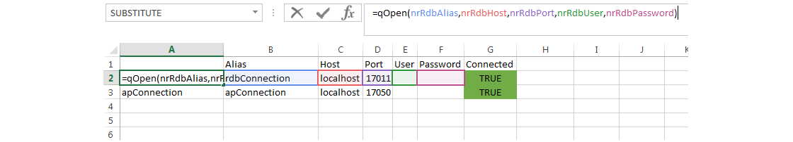
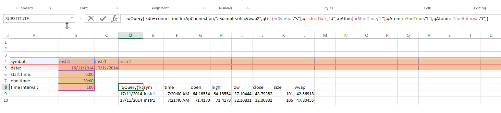
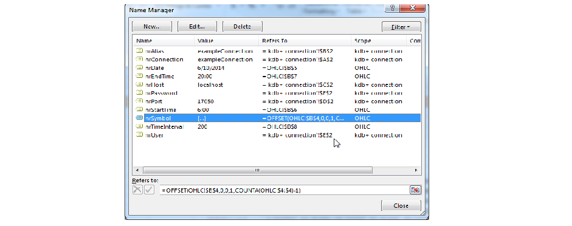

[:arrow_forward:](../Lesson02/README.md)

#                                         **Lesson 1 - Opening a connection and running a query**

<!--------------------------------------------------------------------------------------------------------------------->


This tutorial only covers a subset of the available interface functions contained in qXL add-in.  Please refer 
to `qXL` [documentation](../../Worksheet-Examples.md) for  a full description of all functions.

## Goal of the lesson

The goal of the lesson is to present basic functionalities of `qXL`

- opening a connection
- running a query from Worksheet

You can download the Excel [Workbook](../Lesson01/Lesson01.xlsx) with the content of the lesson.  

<!--------------------------------------------------------------------------------------------------------------------->
## Prerequisites

Although this whole tutorial is built based on the assumption that `Exxeleron` 
[system](https://github.com/exxeleron/enterprise-components) is installed locally, it is possible to use with other 
systems. All parts of code which need amending will be explicitly mentioned.


<!--------------------------------------------------------------------------------------------------------------------->
## Opening connection

To open a connection the `qOpen` formula needs to be called. It is described in details
 [here](../../Worksheet-VBA-API-Functions.md#qopen).

We suggest to have a seperate Sheet in each Workbook which handles all connections (especially if there are multiple
 connections opened). It is more convenient to use Named Ranges for referring to connection details in `qOpen` '
 function, as can be seen on the screen below. 



```
=qOpen(nrRdbAlas,nrRdbHost,nrRdbPort,nrRdbUser,nrRdbPassword)
```

As we see on the screen we have two connections opened:
- first allows to process on port 17011, which corresponds to `core.rdb` component on `Exxeleron` system installed locally
- second allows to process on port 17050, which corresponds to `access.ap` component on `Exxeleron` system installed locally

> Note 
> 
The configuration needs to be changed in case of a system different than `Exxeleron`.  

We also added check cell, which shows whether the connection is open (cell "G2"). The formula inside is simply 
`=A2=B2`, as properly opened connection returns the alias name.  

<!--------------------------------------------------------------------------------------------------------------------->

##Querying from Excel 

The basic query function is `qQuery`. It is described in more detail 
[here](../../Worksheet-VBA-API-Functions.md#qquery). 

It takes the connection alias as the first argument and any `q` statement returning `q` object as the second. We use the already opened connection to `core.rdb` so we can query the process without using handles. In this example we use `q-sql` statement as the second argument. 

> Note
> In case of the production system it is recommended not to query `core.rdb` directly, but to use the access point component. 

 

```
{=qQuery('kdb+ connection'!nrRdbConnection,A1)}
```

As we can see in the Excel Formula Bar the result is returned as an Array Formula. All non scalar results of `qQuery` are 
returned this way. We can now run other queries by changing the content of the cell A1 only. The output range will be 
automatically rescaled to match new query result. 

<!--------------------------------------------------------------------------------------------------------------------->

##Queries with paramaters

Now we will present an example of calling a `qQuery` with multiple argument function being the second `qQuery paramater. 
The [.example.ohlcVwap2](https://github.com/exxeleron/enterprise-components/tree/master/tutorial/Lesson04) function
returns OHLC table based on following parameters:

- sym - list of securities symbols
- d - list of dates
- sTime - start time
- eTime - end time
- binSize - number of seconds

The function is defined on the `access.ap` component, so we use this alias as the first `qQuery` argument.  
We insert example values to Excel cells, as can be seen on the screen below using Named Ranges. 



```
{=qQuery('kdb+ connection'!nrApConnection,".example.ohlcVwap2",qList(nrSymbol,"s"),qList(nrDate,"d"),qAtom(nrStartTime,"t"),qAtom(nrEndTime,"t"),qAtom(nrTimeInterval,"i"))}
```

For getting results, we again use `qQuery` function. This time we need to provide the list of arguments converted to 
proper `q` types. We use `qAtom` for converting scalars and `qList` for converting the list. Documentation of all
conversion functions is available [here](../../Worksheet-VBA-API-Functions.md).

`nrSymbol` Named Range formula is defined in the specific way. It results in automatic expanding of the Named Range `nrSymbol` any time we add new symbol on the right side of the current range. We use the
same convention for `nrDate`. 

```
=OFFSET(OHLC!$B$4,0,0,1,COUNTA(OHLC!$4:$4)-1)
```




