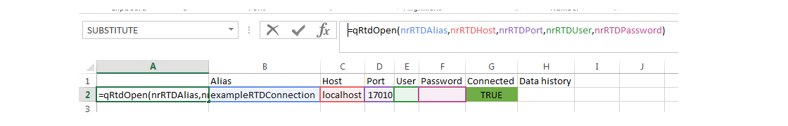
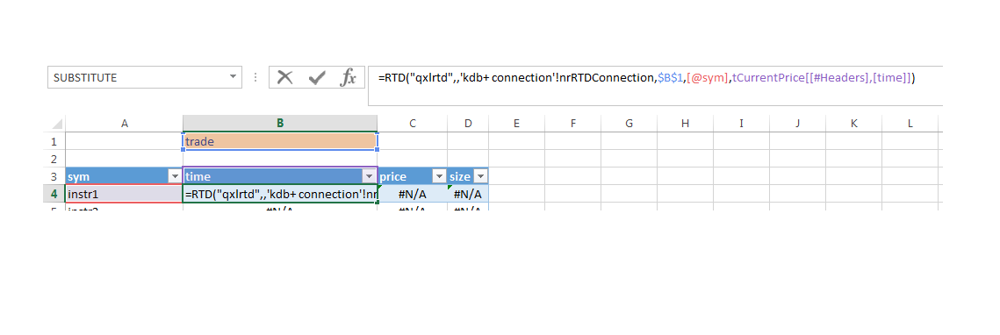
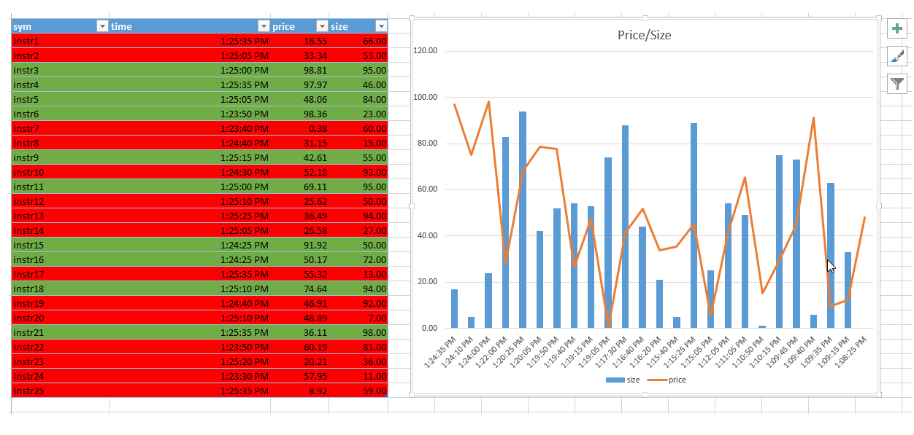

[:arrow_backward:](../Lesson01/README.md) | [:arrow_forward:](../Lesson03/README.md)

#                                         **Lesson 2 - Subscription**

<!--------------------------------------------------------------------------------------------------------------------->


## Goal of the lesson

The goal of the lesson is to present subscription formula `RTD` and its configuration. 
You can download the Excel [Workbook](../Lesson02/Lesson02.xlsx) with the content of the lesson.  


<!--------------------------------------------------------------------------------------------------------------------->
## Prerequisites

Although this whole tutorial is built based on the assumption that `Exxeleron` 
[system](https://github.com/exxeleron/enterprise-components) is installed locally, it is possible to use with other 
systems. All parts of code which need amending will be explicitly mentioned.

<!--------------------------------------------------------------------------------------------------------------------->
## Opening connection

To open a connection the `qRTDOpen` formula needs to be called. It is described in details
 [here](../../RTD-API-Functions.md#qrtdopen).

We suggest to have a separate sheet in each project which handles all connections. It is more convenient to use Named Ranges 
for referring to connection details in `qRTDOpen` ' function, as can be seen on the screen below. 



```
=qRtdOpen(nrRTDAlias,nrRTDHost,nrRTDPort,nrRTDUser,nrRTDPassword)
```

We also added check cell, which shows whether the connection is open (cell "G2"). The formula inside is simply 
`=A2=B2`, as properly opened connection returns the alias name. 

Additionally, we set the publishing history length by using `qRTDConfigure` function as below. The function needs to be executed after opening the Workbook, so the rest of the formulas work properly. 


```
=qRtdConfigure("data.history.length",60)
```

> Note
> 
As we can see on the screen, we opened connection to system running locally on a port `17010`, without using any 
password or user. It refers to the `core.tick` component installed on `Exxeleron` 
[system](https://github.com/exxeleron/enterprise-components) installed locally. For other systems please use different 
credentials. 

<!--------------------------------------------------------------------------------------------------------------------->

##Subscribing from Excel

The basic query function is `RTD`. It is described in details 
 [here](../../RTD-API-Functions.md#rtd). It takes following arguments:
 
  - RTD server implementation  - always "qxlrtd"
  - not used
  - connection name
  - table name
  - instrument
  - column
  - history index (optional)

> Note
> 
We recommend to put RTD formulas within Excel Tables. Once the formula is entered in the first row it is enough to 
type new symbol below the table as Excel automatically extends table range and formulas. 



```
=RTD("qxlrtd",,'kdb+ connection'!nrRTDConnection,$B$1,[@sym],tCurrentPrice[[#Headers],[time]])
```

By using the history index parameter we are able to obtain lag values. The history index specifies the lag number. On the screen below there are two common applications of history index

- table which automatically changes colours based on the price change direction
- dynamically adjusting chart with price/size history. 



<!--------------------------------------------------------------------------------------------------------------------->


