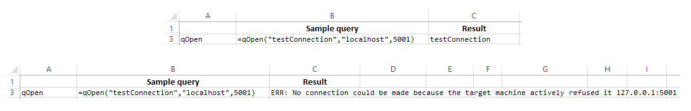
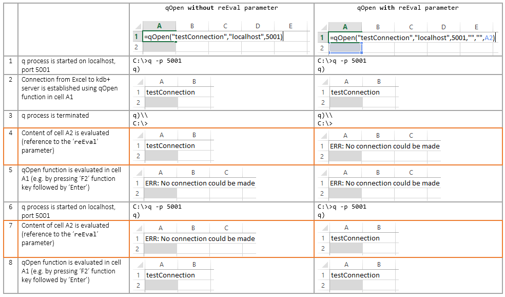
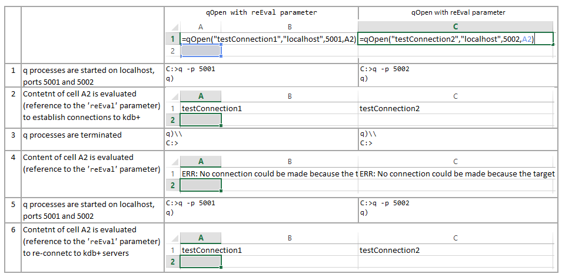
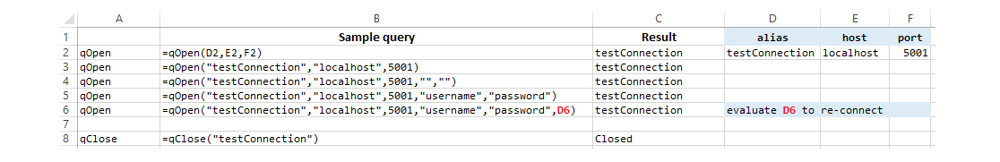
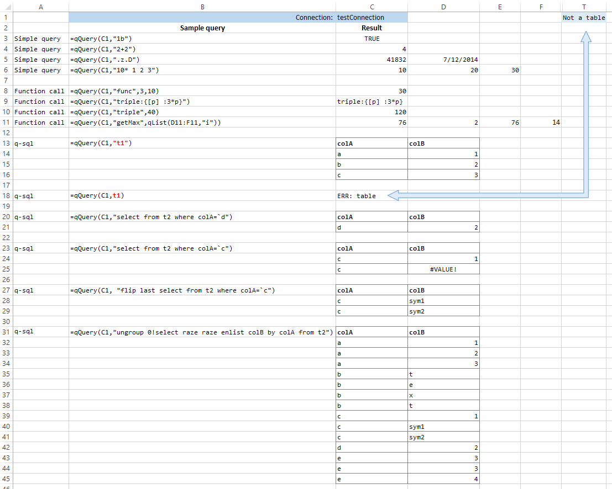
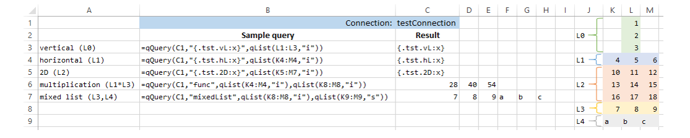
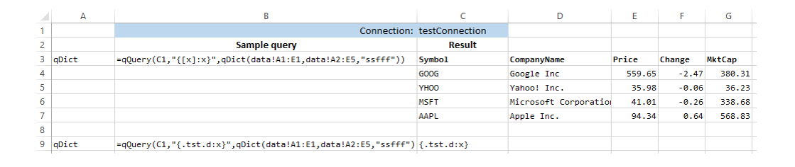
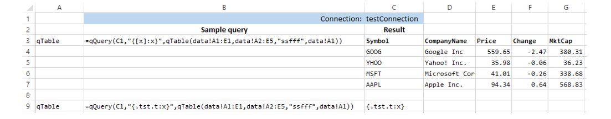

[:arrow_backward:](Worksheet-VBA-API-Functions.md) | [:arrow_forward:](VBA-Examples.md)

# Worksheet examples

- [Preliminaries](Worksheet-Examples.md#preliminaries)
- [Opening and closing connection](Worksheet-Examples.md#opening-and-closing-connection)
- [Querying data](Worksheet-Examples.md#querying-data)
- [Converting data types](Worksheet-Examples.md#converting-data-types)
- [Working with lists](Worksheet-Examples.md#working-with-lists)
- [Working with dictionaries and tables](Worksheet-Examples.md#working-with-dictionaries-and-tables)

<!--------------------------------------------------------------------------------------------------------------------->
## Preliminaries

> :white_check_mark: Hint:

> All examples are available in Excel format from [here](examples/).

#### Q process

Before running examples it is assumed that q process is running on `localhost`, port `5001`.

#### Q test dataset

In order to follow Excel examples, these need to be defined on q process:

```q
q)/ execute on localhost, port 5001
q)func:{[p1;p2] :p1*p2}
q)ret:{[x]:x}
q)dtTest:{[v;dt] :$[dt=type v;`ok;`nok]}
q)mixedList:{[l1;l2]:l1,l2}
q)t1:([]colA:`a`b`c;colB:1 2 3)
q)t2:([]colA:`a`b`c`c`d`e`e`e;colB:(1 2 3;"text";1;`sym1`sym2;2;3;3;4))
q)getMax:{:max x}
```

#### Excel list separators

Please note that depending on `Region` settings different separators can be used. All examples below use US regional 
settings where the separator is set to comma `,`:

```
=qOpen("testConnection","localhost",5001,"username","password")
```

However, some European countries use semicolon `;` instead:

```
=qOpen("testConnection";"localhost";5001;"username";"password")
```

Please make sure to adjust your separator in the code snippets accordingly. Please follow 
[this link](http://windows.microsoft.com/is-is/windows/change-country-region-setting#1TC=windows-7) from Microsoft 
for more details.

<!--------------------------------------------------------------------------------------------------------------------->
## Opening and closing connection

To open a connection to q process, necessary parameters need to be given to `qOpen` function:

```
=qOpen("testConnection","localhost",5001)
```

> Note:

> Typically on production environment one would need to also pass username and password as parameters:
> ```
> =qOpen("testConnection","localhost",5001,"username","password")
> ```

If q process is running, `alias` for connection will be shown in the cell where `qOpen` function was entered. 
Otherwise, error message will appear:



`qOpen` also allows to specify which cell should be evaluated in order to automatically use `qOpen` to connect to the
kdb+ server. Please recall the function signature:

```
String qOpen ( alias, hostname, port, username, password, reEval )
```

where:
- `reEval` [`Cell`] - cell address used for re-evaluating connection to kdb+ server, any data type inside the cell 
can be used (optional)

In order to illustrate this behaviour let's compare `qOpen` with and without `reEval` parameter:



Important differences can be seen in steps `4` and `7`:
- Step 4:
  - **without** `reEval` parameter - cell `A1` / `qOpen` function is not evaluated, therefore
  the content of the cell is not changed
  - **with** `reEval` parameter - cell `A1` / `qOpen` function is evaluated, however, since kdb+ 
  server on port `5001` is no longer running, connection error is displayed in Excel
- Step 7:
  - **without** `reEval` parameter - evaluating cell `A2` has no effect on connection to kdb+ server
  - **with** `reEval` parameter - as in Step 4, evaluating cell `A2` forces re-evaluation in cell `A1` / `qOpen` 
  function; since kdb+ server on port `5001` is running again, connection is established

`reEval` parameter can be very useful if there is need to establish connections or re-connect to many servers at once.
Let's open two connections to kdb+ servers:



Any actions that refer to connections to kdb+ servers (steps 2,4,6) are evaluated using one cell `A2`.
> :heavy_exclamation_mark: Note:

> Internally, `qXL` will store connection details as per given alias only. Therefore, one needs to be careful not to 
> overwrite connection alias with different host and/or port number. For example if at first this call is executed:
> 
> ```
> =qOpen("testConnection","localhost",5001)
> ```
>
> followed by:
>
> ```
> =qOpen("testConnection",172.16.254.1,17000)
> ```
> 
> then all functions using `testConnection` alias will refer to host `172.16.254.1` on port `17000`.

Closing connection can be done by using the same alias as given in the `qOpen` function:

```
=qClose("testConnection")
```

If connection is terminated, the `Closed` message will be shown. Consecutive calls (without invoking another `qOpen` 
function) to `qClose` function will give the `Unknown alias` error message:


Summary below shows all function calls which can be used to open and close connection between `qXL` and kdb+ server:



<!--------------------------------------------------------------------------------------------------------------------->
## Querying data

There are several queries that can be run against q server, some of these are listed below. For all queries below it is 
assumed that connection alias is in cell `C1`.

### Simple query

```
| =qQuery(C1,"1b")  | TRUE |
| =qQuery(C1,"2+2") | 4    |
```

In some cases cell formatting might need to be used to show value in user-friendly format. For example here:

```
| =qQuery(C1,".z.D") | 41796 | 6/6/2014 |
```

numerical value `41796` in the next cell is formatted to date format `6/6/2014`.

There are also cases when cell content could be overwritten. For example, in a Worksheet such as this one:

```
| row / col | C                         | D    | E     |
|-----------|---------------------------|------|-------|
| 6         |                           | 1234 | text  |
```

updating cell `C6` with a query would display a list of three elements in three consecutive cells overwriting 
previous content:

```
| row / col | C                         | D    | E     |
|-----------|---------------------------|------|-------|
| 6         | =qQuery(C1,"10* 1 2 3")   | 20   | 30    |
```

or, to be exact:

```
| row / col | C                         | D    | E     |
|-----------|---------------------------|------|-------|
| 6         | 10                        | 20   | 30    |
```

> :heavy_exclamation_mark: Note:

> Array elements (as well as content of dictionaries and tables) cannot be changed once the values are displayed in 
> Excel. Please read 
> [this section](http://office.microsoft.com/en-001/excel-help/guidelines-and-examples-of-array-formulas-HA010228458.aspx#BM2) 
> from Microsoft for more details about array constants.

### Function call

To call a function already defined on a q process:

```
| =qQuery(C1,"func",3,10) | 30 |
``` 

Custom functions can also be also dynamically defined on a q process:

```
=qQuery(C1,"triple:{[p] :3*p}")
```

This function can then be used later in the worksheet:

```
| =qQuery(C1,"triple",40) | 120 |
```

> :heavy_exclamation_mark: Note:

> Only atoms (single values) can be used as parameters in function calls. In cases where more complex
> structures are needed, please use Excel ranges instead. For example:
> ```
> =qQuery(C1,"getMax",qList(D11:F11,"i"))
> ```
> instead of:
> ```
> =qQuery(C1,"getMax",qList({11,55,10},"i"))
> ```
> This is especially important for handling lists, dictionaries and tables which will be covered later in more detail.

### q-sql

`qQuery` can also be used to display content of the table. Simple table can be shown in the following way:

```
=qQuery(C1,"t1")
```

producing:

```
| colA | colB |
|------|------|
| a    | 1    |
| b    | 2    |
| c    | 3    |
```

> :warning: Note:

> Quotes around table name (`"t1"`) indicate that this string will be treated as q statement. Omitting those will cause
> Excel to use `t1` as cell address. Please see the screenshot at the bottom of this section for more details.

Subset of the table can also be selected from the table, for example:

```
=qQuery(C1,"select from t2 where colA=`d")
```

However, there is one point to remember - any complex content (list, dictionary, another table within the result, etc.) 
will not be displayed, instead Excel will show `#Value!` message. In case of `t2`:

```q
q)select from t2 where colA=`c
colA colB
---------------
c    1
c    `sym1`sym2
```

In the above snippet `colB` contains a list (`` `sym`sym2 ``) which will not be shown in the Worksheet:

```
=qQuery(C1,"select from t2 where colA=`c")
```

which gives:

```
| colA | colB    |
|------|---------|
| c    | 1       |
| c    | #VALUE! |
```

If needed, content can be always inspected by 'tweaking' query, for example:

```
=qQuery(C1,"flip last select from t2 where colA=`c")
```

providing more details:

```
| colA | colB |
|------|------|
| c    | sym1 |
| c    | sym2 |
```

> Hint:

> [`Ungroup`](http://code.kx.com/wiki/Reference/ungroup) function can also be used, for example:
> ```
> =qQuery(C1,"ungroup 0!select raze raze enlist colB by colA from t2")
> ```

Here are all the examples used above for `qQuery` function:




#### qQueryRange

For all non-scalar results `qQuery` returns Excel Array Formula with the proper dimensions. Thanks to this, the result range in Excel will automatically adjust its size when we call `qQuery` again and the original `q` object was modified in the meantime (for example if any deletes or inserts have been done on the table). 

```
=qQueryRange(C1,"t1")
```

Returning Array Formula disallows however changing the output through the Excel. Any modification prompts the error as below


For that reason, the second function `qQueryRange` was introduced which works similarly as `qQuery` but prints the `q` output to the range instead of creating an Array Formula. 

> Note
> 
> We suggest to use `qQueryRange` to query constantly growing tables, as each consecutive query will return the range which is least as big as the previous one. In other cases `qQuery` is preferable. 

<!--------------------------------------------------------------------------------------------------------------------->
## Converting data types

`qAtom` is only used to convert data types between Excel and q. Please recall that function requires two parameters - 
value to be parsed and data type:

```
Object qAtom ( value, type )
```

In order to use this function in Excel, one will always need to combine it with some other function(s). For example:

```
| =qQuery(C1, "func",qAtom(10,"i"),20)    | 200 | 
| =qQuery(C1, "func",qAtom(10.99,"i"),20) | 220 |
```

where q is 'forced' to treat `10` as an `int` and use `func` to multiply both arguments. 
Similarly, enforcing simple data type checks can be done this way:

```
| =qQuery(C1, "dtTest",qAtom(255,"i"),-6) | ok  |
| =qQuery(C1, "dtTest",qAtom(255,"i"),-8) | nok |
| =qQuery(C1, "dtTest",qAtom(255,"e"),-8) | ok  |
```

> :white_check_mark: Hint:

> Please visit [code.kx.com](http://code.kx.com/wiki/Reference/Datatypes) for details about available q data types. 
[Type mapping](Type-Mapping.md) lists strings used for conversions, those also apply to `qList`, `qDict` and `qTable` 
functions described below.

Examples for `qAtom`:


<!--------------------------------------------------------------------------------------------------------------------->
## Working with lists

> :heavy_exclamation_mark: Note:

> `qList` can only operate using Excel ranges. Using values directly in this functions can result in unexpected 
> behaviour!

`qList` performs conversion of Excel values to lists as understood by q. In general, if one-dimensional range is given,
`qList` will convert it to simple list regardless of the vertical / horizontal range. However, if two-dimensions are 
used, `qList` will convert those values to list of lists. For example, for the following input data:

```
| row / col |  K |  L |  M |
|-----------|----|----|----|
| 1         |    |  1 |    |    ( L0 )
| 2         |    |  2 |    |    ( L0 )
| 3         |    |  3 |    |    ( L0 )
| 4         |  4 |  5 |  6 |    ( L1 )
| 5         | 10 | 11 | 12 |    ( L2 )
| 6         | 13 | 14 | 15 |    ( L2 )
| 7         | 16 | 17 | 18 |    ( L2 )
| 8         |  7 |  8 |  9 |    ( L3 )
| 9         |  a |  b |  c |    ( L4 )
```

the range that `qList` can receive might be either:

1. Vertical - where input is processed as simple q list, for example from the following query:

  ```
  =qQuery(C1,"{.tst.vL:x}",qList(L1:L3,"i"))
  ```

  inspecting `.tst.vL` returns in q:

  ```
  q).tst.vL
  1 2 3i
  ```

1. Horizontal - where input is also processed as simple lists:

  ```
  =qQuery(C1,"{.tst.hL:x}",qList(K4:M4,"i"))
  ```

  where:

  ```
  q).tst.hL
  4 5 6i
  ```

1. Two-dimensional - range is treated as list of lists:

  ```
  =qQuery(C1,"{.tst.2D:x}",qList(K5:M7,"i"))
  ```

  and:

  ```
  q).tst.2D
  10 13 16
  11 14 17
  12 15 18
  q)first .tst.2D
  10 13 16i
  ```

Last two examples in the image below show multiplication of lists as well as concatenating of mixed lists:



<!--------------------------------------------------------------------------------------------------------------------->
## Working with dictionaries and tables

> :heavy_exclamation_mark: Note:

> `qDict` and `qTable` can only operate using Excel ranges. Using values directly in bodies of these functions can
> result in unexpected behaviour!

### `qDict`

`qDict` is used to build a dictionary. For example, for this sample located in worksheet `data`:

```
| row / col | A      | B                     | C      | D      | E      |
| 1         | Symbol | CompanyName           | Price  | Change | MktCap |
| 2         | GOOG   | Google Inc            | 559.65 | -2.47  | 380.31 |
| 3         | YHOO   | Yahoo! Inc.           | 35.98  | -0.06  | 36.23  |
| 4         | MSFT   | Microsoft Corporation | 41.01  | -0.26  | 338.68 |
| 5         | AAPL   | Apple Inc.            | 94.34  |  0.64  | 568.83 |

```

one could use similar statement:

```
=qQuery(C1,"{[x]:x}",qDict(data!A1:E1,data!A2:E5,"ssfff"))
```

where:
- `data!A1:E1` - defines keys for dictionary
- `data!A2:E5` - defines data range
- `ssfff` - specifies data types for values for each of the keys

> Hint:

> For more details on dictionaries please visit [code.kx.com](http://code.kx.com/wiki/JB:QforMortals2/dictionaries) page.

Also, please remember that Excel shows data in tabular form. For example, by running this query in Excel:

```
=qQuery(C1,"{.tst.d:x}",qDict(data!A1:E1,data!A2:E5,"ssfff"))
```

and inspecting `.tst.d` typical operations on dictionaries can be performed:

```
q).tst.d
Symbol     | GOOG       YHOO        MSFT                  AAPL
CompanyName| Google Inc Yahoo! Inc. Microsoft Corporation Apple Inc.
Price      | 559.65     35.98       41.01                 94.34
Change     | -2.47      -0.06       -0.26                 0.64
MktCap     | 380.31     36.23       338.68                568.83
q)
q)key .tst.d
`Symbol`CompanyName`Price`Change`MktCap
q)
q)value .tst.d
GOOG       YHOO        MSFT                  AAPL
Google Inc Yahoo! Inc. Microsoft Corporation Apple Inc.
559.65     35.98       41.01                 94.34
-2.47      -0.06       -0.26                 0.64
380.31     36.23       338.68                568.83
q)
q).tst.d[`Symbol]
`GOOG`YHOO`MSFT`AAPL
```

Examples for `qDict`:



<!--------------------------------------------------------------------------------------------------------------------->
### `qTable`

Table can be created in similar fashion as in case of `qDict`, using the same dataset as before following statement can
be used:

```
=qQuery(C1,"{[x]:x}",qTable(data!A1:E1,data!A2:E5,"ssfff",data!A1))
```

There are two small differences when comparing `qTable` to `qDict`:

1. `data!A1:C1` - first parameter describes column names (vs. keys in `qDict`)
2. `data!A1` - last parameter specifies key(s) for the table, in the above case column `Symbol` was used as a key

These difference can be seen clearly when comparing function definition for `qDict` and `qTable`:

```
Object qDict  ( keys,        values, types )
Object qTable ( columnNames, values, types, keys )
```

> Hint:

> For more details on keyed tables please visit 
[code.kx.com](http://code.kx.com/wiki/JB:QforMortals2/tables#Primary_Keys_and_Keyed_Tables) page.

As before, inspecting `.tst.t` shows:

```
q).tst.t
Symbol| CompanyName           Price  Change MktCap
------| ------------------------------------------
GOOG  | Google Inc            559.65 -2.47  380.31
YHOO  | Yahoo! Inc.           35.98  -0.06  36.23
MSFT  | Microsoft Corporation 41.01  -0.26  338.68
AAPL  | Apple Inc.            94.34  0.64   568.83
q)
q)meta .tst.t
c          | t f a
-----------| -----
Symbol     | s
CompanyName| s
Price      | f
Change     | f
MktCap     | f
q)
q)keys .tst.t
,`Symbol
q)
q)select from .tst.t where Symbol=`GOOG
Symbol| CompanyName Price  Change MktCap
------| --------------------------------
GOOG  | Google Inc  559.65 -2.47  380.31
```

Examples for `qTable`:


